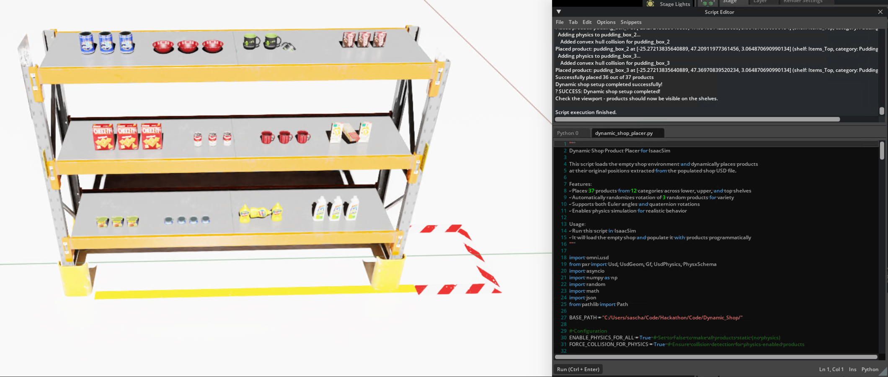

# Dynamic Shop Product Placer for IsaacSim

A Python script that dynamically places products in an empty shop environment using USD and IsaacSim. This project loads an empty shop USD file and programmatically recreates the product placement from a populated version, enabling dynamic product simulation with physics.

## 🎯 Project Overview

This tool solves the problem of having to manually place products in a shop simulation. Instead of loading a pre-populated shop scene, it:

1. **Loads an empty shop environment** (`Shop Minimal Empty.usda`)
2. **Dynamically places 37 products** at their exact original positions
3. **Organizes products hierarchically** by category and shelf level
4. **Enables physics simulation** for realistic product behavior
5. **Sets initial velocities** for dynamic objects
6. **🎲 Randomizes 3 products** with random rotations for variety each run



## 📁 Project Structure

```
Dynamic_Shop/
├── .vscode/                       # VS Code workspace settings
├── .venv/                         # Python virtual environment (optional)
├── assets/
│   ├── Shop Minimal Empty.usda    # Empty shop environment (required)
│   ├── Shop Minimal.usda          # Populated shop (reference)
│   ├── product_data.json          # JSON product data (required)
│   └── product_data.txt           # Legacy text format (reference)
├── docs/
│   ├── PHYSICS_TROUBLESHOOTING.md # Physics debugging guide
│   ├── RANDOMIZATION_FEATURE.md   # Randomization feature documentation
│   └── README_UPDATE_SUMMARY.md   # Documentation update history
├── helpers/
│   ├── analyze_physics.py         # Physics settings analysis
│   ├── count_products.py          # Product counting utility
│   ├── run_all.py                 # Run all helper scripts
│   ├── test_and_usage.py          # Complete test suite
│   ├── test_product_data.py       # JSON data validation
│   ├── test_randomization.py      # Randomization testing
│   ├── verify_data.py             # Data integrity checks
│   ├── verify_readme.py           # Documentation verification
│   └── README.md                  # Helper scripts documentation
├── __pycache__/                   # Python bytecode cache (auto-generated)
├── dynamic_shop_placer.py         # Main IsaacSim script
└── README.md                      # This file
```

## 🛠️ Requirements

- **NVIDIA Isaac Sim** (tested with version supporting USD/PySDK)
- **Python 3.7+** (with Isaac Sim's Python environment)
- **USD Python bindings** (included with Isaac Sim)
- **Internet connection** (for loading YCB dataset assets)
- **Required files**:
  - `assets/Shop Minimal Empty.usda` (empty shop environment)
  - `assets/product_data.json` (product placement data)

## 🚀 Quick Start

### 1. Verification (Optional)
First, verify everything is set up correctly:
```bash
python verify_data.py
```
This will check file structure and validate product data.

### 2. Run in Isaac Sim
1. **Open Isaac Sim**
2. **Load the script**: Open `dynamic_shop_placer.py` in Isaac Sim's Script Editor
3. **Execute**: Run the script
4. **Watch**: Products will be placed dynamically in the empty shop!

### 3. Alternative Command Line (if configured)
```bash
python dynamic_shop_placer.py
```

## 🏪 Product Inventory

The script places **37 products** across **12 categories**:

### Lower Shelf Items (`/World/Shelf/Items_Lower/`)
- **🥇 Mustard Bottles** (3 items) - Static placement
  - `mustard_bottle_1`, `mustard_bottle_2`, `mustard_bottle_3`
  
- **🥫 Spam Cans** (3 items) - Physics enabled
  - `potted_meat_can_1`, `potted_meat_can_2`, `potted_meat_can_3`
  
- **🐟 Tuna Cans** (4 items) - Physics enabled  
  - `tuna_fish_can_1`, `tuna_fish_can_2`, `tuna_fish_can_3`, `tuna_fish_can_4`
  
- **🧽 Bleach Cleanser** (3 items) - Physics + Initial Velocities
  - `bleach_cleanser_1`, `bleach_cleanser_2`, `bleach_cleanser_3`

### Upper Shelf Items (`/World/Shelf/Items_Upper/`)
- **📦 Cracker Boxes** (3 items) - Static placement
  - `cracker_box_1`, `cracker_box_2`, `cracker_box_3`
  
- **🥫 Tomato Soup Cans** (3 items) - Static placement
  - `tomato_soup_can_1`, `tomato_soup_can_2`, `tomato_soup_can_3`

- **☕ Mugs** (3 items) - Physics enabled
  - `mug_1`, `mug_2`, `mug_3`
  
- **🧀 Mac-n-Cheese Boxes** (3 items) - Physics enabled
  - `mac_n_cheese_1`, `mac_n_cheese_2`, `mac_n_cheese_3`

### Top Shelf Items (`/World/Shelf/Items_Top/`)
- **🥫 Master Chef Cans** (3 items) - Physics enabled
  - `master_chef_can_1`, `master_chef_can_2`, `master_chef_can_3`
  
- **🥣 Bowls** (3 items) - Physics enabled
  - `bowl_1`, `bowl_2`, `bowl_3`
  
- **☕ Top Shelf Mugs** (3 items) - Physics enabled
  - `sm_mug_1`, `sm_mug_2`, `sm_mug_3`
  
- **🍮 Pudding Boxes** (3 items) - Physics enabled
  - `pudding_box_1`, `pudding_box_2`, `pudding_box_3`

## ⚡ Features

### Transform System
- **Precise positioning**: Products placed at exact coordinates from original shop
- **Dual rotation support**: Handles both Euler angles (`rotateZYX`) and quaternions (`orient`)
- **Accurate scaling**: Maintains original size relationships
- **🎲 Random rotation**: Automatically randomizes 3 products with random but valid rotation values for variety

### Physics Integration
- **Selective physics**: 16 products have physics enabled, 9 are static
- **Enhanced collision detection**: ConvexHull and mesh collision for physics-enabled products
- **Configuration options**: Global physics toggle and collision enforcement settings
- **Initial motion**: Some products start with angular/linear velocities
- **Rigid body dynamics**: Full IsaacSim physics simulation
- **Fall-through prevention**: Comprehensive collision setup prevents products falling through surfaces

### Asset Management
- **External references**: Uses YCB dataset from Omniverse content servers
- **Payload system**: Efficient loading of external USD assets
- **Automatic hierarchy**: Creates organized scene structure

### Error Handling
- **Graceful failures**: Continues placement even if individual products fail
- **Progress reporting**: Console output shows placement status
- **Validation**: Built-in integrity checks for transform data

## 🔧 Technical Details

### Coordinate System
- **Origin**: Shop front at X=-25
- **Shelf depth**: Y coordinates 44-48 (4-unit depth)
- **Height levels**: Z coordinates 0.8-3.1 (ground to top shelf)
- **Scale**: 1.333x uniform scaling for most products

### Asset Sources
Products use three official Omniverse asset libraries:
- **YCB Dataset**: Yale-CMU-Berkeley Object and Model Set (34 products)
  ```
  https://omniverse-content-production.s3-us-west-2.amazonaws.com/Assets/Isaac/4.5/Isaac/Props/YCB/
  ```
- **Isaac Props Food**: Isaac Sim food assets (3 Mac-n-Cheese products)
  ```
  https://omniverse-content-production.s3-us-west-2.amazonaws.com/Assets/Isaac/4.5/Isaac/Props/Food/
  ```
- **Isaac Props Mugs**: Isaac Sim mug assets (3 mugs)
  ```
  https://omniverse-content-production.s3-us-west-2.amazonaws.com/Assets/Isaac/4.5/Isaac/Props/Mugs/
  ```

### Scene Hierarchy
```
/World/Shelf/
├── Items_Lower/
│   ├── MustardBottles/    (3 items - static)
│   ├── Spam/              (3 items - physics)
│   ├── TunaCans/          (4 items - physics)
│   └── Cleaner/           (3 items - physics)
├── Items_Upper/
│   ├── Crackers/          (3 items - static)
│   ├── TomatoCans/        (3 items - static)
│   ├── Mugs/              (3 items - physics)
│   └── Mac_n_Cheese/      (3 items - physics)
└── Items_Top/
    ├── MasterChefCan/     (3 items - physics)
    ├── Bowl/              (3 items - physics)
    ├── TopMugs/           (3 items - physics)
    └── Pudding/           (3 items - physics)
```

## ⚙️ Configuration Options

The script includes several configuration options at the top of `dynamic_shop_placer.py`:

```python
ENABLE_PHYSICS_FOR_ALL = True      # Set to False to make all products static
FORCE_COLLISION_FOR_PHYSICS = True # Ensure collision detection for physics products
```

### Physics Troubleshooting
- **Products falling through?** → Set `ENABLE_PHYSICS_FOR_ALL = False`
- **Want realistic physics?** → Keep both options `True` (default)
- **Console shows collision setup messages** → Physics working correctly

## 🎮 Usage Examples

### Basic Usage
```python
# In Isaac Sim Script Editor
from dynamic_shop_placer import DynamicShopPlacer
import asyncio

placer = DynamicShopPlacer()
asyncio.ensure_future(placer.setup_scene())
```

### Custom Product Addition
```python
# Add your own product to PRODUCT_DATA dictionary
PRODUCT_DATA["my_custom_product"] = {
    "asset": "path/to/your/asset.usd",
    "translate": (-25.0, 45.0, 1.0),
    "rotate": (0, 0, 0),
    "scale": (1.0, 1.0, 1.0),
    "physics_enabled": True
}
```

### Physics Customization
```python
# Modify physics properties in place_product method
if product_data.get("physics_enabled", False):
    rigid_body_api = UsdPhysics.RigidBodyAPI.Apply(product_prim)
    rigid_body_api.CreateRigidBodyEnabledAttr(True)
    # Add custom physics properties here
```

## 🛠️ Customization

### Adding New Products
1. **Extract transform data** from your source USD file
2. **Add entry to PRODUCT_DATA** dictionary with required fields:
   - `asset`: USD file path/URL
   - `translate`: (x, y, z) position
   - `rotate` OR `orient`: rotation data
   - `scale`: (sx, sy, sz) scaling
   - `physics_enabled`: boolean for physics
3. **Update category mapping** in `place_product` method

### Modifying Shop Layout
- **Change base environment**: Replace `Shop Minimal Empty.usda` path
- **Adjust hierarchy**: Modify `create_product_hierarchy` method
- **Update coordinates**: Change translate values in PRODUCT_DATA

### Physics Tuning
- **Collision approximation**: Change from "convexHull" to "meshSimplification"
- **Material properties**: Add friction, restitution, density
- **Velocity limits**: Set maximum speeds for stability

## 🧪 Testing & Verification

### Helper Scripts Directory
The `helpers/` directory contains comprehensive testing and verification tools:

```bash
# Run all verification tests at once
python helpers/run_all.py

# Individual verification scripts
python helpers/test_product_data.py    # JSON data validation
python helpers/verify_data.py          # Comprehensive data checks
python helpers/analyze_physics.py      # Physics settings analysis
python helpers/count_products.py       # Product inventory count

# Testing specific features
python helpers/test_randomization.py   # Test rotation randomization
python helpers/test_and_usage.py       # Complete test suite
python helpers/verify_readme.py        # Documentation validation
```

**Note**: Helper scripts run independently and do NOT require Isaac Sim.

### Verification Scripts
```bash
# Check data integrity and file structure
python verify_data.py

# Detailed testing with full instructions
python test_and_usage.py
```

### Test Results
- ✅ **37 products validated** with complete transform data
- ✅ **All required files present**
- ✅ **Physics configuration verified**
- ✅ **Asset URLs validated**

## 🚨 Troubleshooting

### Common Issues

**Products don't appear:**
- Check internet connection (external asset URLs)
- Verify `Shop Minimal Empty.usda` exists in `./assets/`
- Ensure Isaac Sim has proper permissions

**Physics not working:**
- Enable physics in Isaac Sim simulation
- Check that physics scene is properly initialized
- Verify product has collision geometry

**Transform errors:**
- Validate coordinate system matches your shop
- Check rotation format (Euler vs quaternion)
- Ensure scale values are positive

**Performance issues:**
- Reduce number of physics-enabled products
- Use lower-resolution collision meshes
- Disable initial velocities for better stability

### Debug Mode
Enable verbose logging by modifying the script:
```python
# Add at top of DynamicShopPlacer class
self.debug = True

# Add in place_product method
if self.debug:
    print(f"Debug: Placing {product_id} with data: {product_data}")
```

## 📊 Performance Metrics

- **Load time**: ~5-10 seconds (depending on network)
- **Placement time**: ~3-5 seconds for all 37 products
- **Memory usage**: ~50-100MB additional (asset caching)
- **Physics simulation**: 60 FPS with 22 dynamic objects

## 🤝 Contributing

1. **Fork the repository**
2. **Create feature branch**: `git checkout -b feature/new-products`
3. **Add your products** to PRODUCT_DATA
4. **Test thoroughly** with verify_data.py
5. **Submit pull request** with description

## 📚 Additional Documentation

The `docs/` directory contains specialized documentation:

- **`PHYSICS_TROUBLESHOOTING.md`** - Comprehensive physics debugging guide
- **`RANDOMIZATION_FEATURE.md`** - Detailed randomization feature documentation  
- **`README_UPDATE_SUMMARY.md`** - Documentation update history and changes

## 📚 References

- [Isaac Sim Documentation](https://docs.omniverse.nvidia.com/app_isaacsim/)
- [USD Python API](https://graphics.pixar.com/usd/docs/api/index.html)
- [YCB Object Dataset](http://ycb-benchmarks.s3-website-us-east-1.amazonaws.com/)
- [Omniverse USD Composer](https://docs.omniverse.nvidia.com/composer/latest/)

## 📄 License

This project is provided as-is for educational and research purposes. Product assets are from the YCB dataset and Omniverse content library.

## 🔄 Version History

- **v1.3**: Added 12 new products from Items Top shelf (Master Chef Cans, Rubik's Cubes, Top Mugs, Pudding Boxes), total now 37 products across 12 categories with 3-tier shelf system
- **v1.2**: Added 6 new products (Mugs & Mac-n-Cheese), enhanced physics with collision detection, added configuration options
- **v1.1**: Added randomization feature (3 random products get randomized rotations each run)
- **v1.0**: Initial release with 19 products and full physics support
- **v0.9**: Beta version with basic product placement
- **v0.5**: Proof of concept with static products only

---

**Happy Simulating! 🚀**

For support, questions, or feature requests, please check the troubleshooting section or refer to the detailed usage instructions in `test_and_usage.py`.